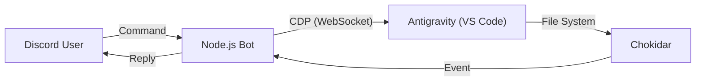

# Antigravity Discord Bot 仕様書

## 1. 概要
このBotは、Chrome DevTools Protocol (CDP) を利用して、ローカルで動作するAntigravity (VS Code Fork) をDiscordから遠隔操作するためのツールです。
Antigravity自体にはAPIがないため、CDPを通じてDOM操作やJavaScript実行を行うことで機能を実現しています。

## 2. システム構成

### アーキテクチャ図

### 主要コンポーネント
- **CDP (Chrome DevTools Protocol)**: AntigravityのWebView（iframe）内のDOMにアクセスし、ボタンクリックやテキスト取得を行います。
- **Chokidar**: ファイルシステムの変更を監視し、Antigravityが生成したファイルや変更を検知してDiscordに通知します。
- **Discord.js**: Discord APIとの通信を行います。

## 3. 機能詳細

### 3.1 テキスト生成
- ユーザーからのメッセージをCDP経由でAntigravityのチャット入力欄に注入します。
- 入力欄のセレクター: `textarea[class*="input"]` など
- 送信ボタンのクリックまたは `Enter` キーイベントの発火によって生成を開始します。

### 3.2 モデル切替 (`/model`)
- AntigravityのUI上にあるモデル選択ドロップダウンを操作します。
- **DOM操作**:
  1. `<button aria-expanded="false">` をクリックしてドロップダウンを展開。
  2. ドロップダウン内のモデル名リストを取得。
  3. 指定されたモデル名の要素をクリック。
  - iframe内にあるため、全iframeを走査して対象要素を探します。

### 3.3 モード切替 (`/mode`)
- Planning Mode / Fast Mode の切替を行います。
- **DOM操作**:
  1. モード切替トグルをクリック。
  2. ダイアログ内の "Planning" または "Fast" をクリック。

### 3.4 チャットタイトル取得 (`/title`)
- 現在のチャットセッションのタイトルを取得します。
- **DOM操作**:
  - `p.text-ide-sidebar-title-color` クラスを持つ要素を探し、そのテキストを取得します。

### 3.5 ファイル監視
- プロジェクトルート（デフォルトはボットの親ディレクトリ、環境変数 `WATCH_DIR` や起動時の対話設定で指定可能）以下のファイル変更を監視します。
- 除外ファイル: `node_modules`, `.git`, `.env`, ログファイルなど。
- 新規作成 (`add`) または変更 (`change`) があった場合、そのファイルパスと内容（テキストファイルの場合）をDiscordに通知します。

## 4. 環境設定

### 必要な環境変数 (.env)
- `DISCORD_BOT_TOKEN`: Discord Botのトークン
- `DISCORD_ALLOWED_USER_ID`: 操作を許可するユーザーID（セキュリティのため制限）
- `WATCH_DIR`: (任意) 監視対象のディレクトリパス。未指定の場合は起動時に対話的に設定を求められ、空欄でEnterを押すと監視機能が無効化されます。

### 依存関係
- `discord.js`: ^14.x
- `chokidar`: ^3.x
- `ws`: ^8.x
- `dotenv`: ^16.x
