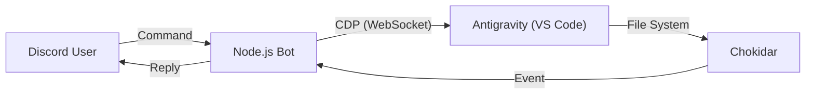

# Antigravity Discord Bot 仕様書

## 1. 概要
このBotは、Chrome DevTools Protocol (CDP) を利用して、ローカルで動作するAntigravity (VS Code Fork) をDiscordから遠隔操作するためのツールです。
Antigravity自体にはAPIがないため、CDPを通じてDOM操作やJavaScript実行を行うことで機能を実現しています。

## 2. システム構成

### アーキテクチャ図

### 主要コンポーネント
- **CDP (Chrome DevTools Protocol)**: AntigravityのWebView（iframe）内のDOMにアクセスし、ボタンクリックやテキスト取得を行います。
- **Chokidar**: ファイルシステムの変更を監視し、Antigravityが生成したファイルや変更を検知してDiscordに通知します。
- **Discord.js**: Discord APIとの通信を行います。
- **Node-cron style Scheduler**: 指定時刻にタスクを実行する内部スケジューラ。

## 3. 機能詳細

### 3.1 テキスト生成
- ユーザーからのメッセージをCDP経由でAntigravityのチャット入力欄に注入します。
- 入力欄のセレクター: `textarea[class*="input"]` など
- 送信ボタンのクリックまたは `Enter` キーイベントの発火によって生成を開始します。

### 3.2 モデル切替 (`/model`)
- AntigravityのUI上にあるモデル選択ドロップダウンを操作します。
- **DOM操作**:
  1. `<button aria-expanded="false">` をクリックしてドロップダウンを展開。
  2. ドロップダウン内のモデル名リストを取得。
  3. 指定されたモデル名の要素をクリック。
  - iframe内にあるため、全iframeを走査して対象要素を探します。

### 3.3 モード切替 (`/mode`)
- Planning Mode / Fast Mode の切替を行います。
- **DOM操作**:
  1. モード切替トグルをクリック。
  2. ダイアログ内の "Planning" または "Fast" をクリック。

### 3.4 承認ブリッジ
- Antigravity側で「許可/拒否」を求めるダイアログ（ターミナル実行前など）が表示された際、それを検知してDiscordにボタン付きメッセージを送信します。
- **仕組み**:
  1. ポーリングにより `aria-label` が "Allow" や "Cancel" のボタンを含むダイアログを監視。
  2. Discordのインタラクション（ボタンクリック）に応じて、CDP経由でAntigravity側の該当ボタンをクリックします。

### 3.5 スケジュール機能 (`/schedule`)
- `workspace/schedules.json` に保存されたタスクを、指定時刻に自動実行します。
- **仕組み**:
  - `setInterval` による1分ごとのチェック。
  - 実行時は擬似的なメッセージオブジェクトを作成し、既存のメッセージ注入フローに渡します。

### 3.6 マルチウィンドウ対応
- 複数のAntigravityウィンドウが開いている場合、デバッグポートを通じてどの一覧を取得し、操作対象を動的に変更できます。
- `/list_windows` でターゲット一覧を取得し、`/select_window` で `webSocketDebuggerUrl` を切り替えます。

### 3.7 ファイル監視
- プロジェクトルート（環境変数 `WATCH_DIR`（内部変数 `WORKSPACE_ROOT`）で指定可能）以下のファイル変更を監視します。
- 除外ファイル: `node_modules`, `.git`, `.env`, ログファイルなど。
- 新規作成 (`add`) または変更 (`change`) があった場合、そのファイルパスと内容（テキストファイルの場合）をDiscordに通知します。

## 4. 環境設定

### 必要な環境変数 (.env)
- `DISCORD_BOT_TOKEN`: Discord Botのトークン
- `DISCORD_ALLOWED_USER_ID`: 操作を許可するユーザーID（セキュリティのため制限）
- `WATCH_DIR`: (任意) 監視対象のディレクトリパス。未指定の場合は起動時に対話的に設定を求められます。

### 依存関係
- `discord.js`: ^14.x
- `chokidar`: ^3.x
- `ws`: ^8.x
- `dotenv`: ^16.x

## 5. ログ管理
- `discord_interaction.log`: Botの動作ログ、コマンド実行履歴、CDP接続エラーなどを記録します。
- `bot_log.txt`: 起動時のデバッグ情報などを記録します。
